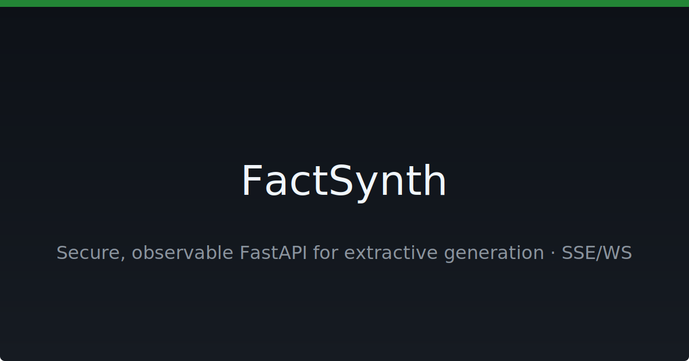

# FactSynth

[](https://github.com/neuron7x/FactSynth/actions/workflows/ci.yml)
[](https://github.com/neuron7x/FactSynth/actions/workflows/codeql.yml)
[](LICENSE)
[](https://github.com/neuron7x/FactSynth/stargazers)

[](https://github.com/neuron7x/FactSynth/issues)
[](https://github.com/neuron7x/FactSynth/pulls)
<!-- markdownlint-disable-next-line MD013 -->
[](https://neuron7x.github.io/FactSynth/)



FastAPI service for intent reflection and extractive generation with
SSE/WebSocket streaming,
Problem+JSON errors, rate limits, and rich observability.

Language: EN · [Українська](./README_UA.md)

## Table of Contents

- [About](#about)
- [Features](#features)
- [Tech Stack](#tech-stack)
- [Quick Start](#quick-start)
- [Configuration](#configuration)
- [Demo & OpenAPI](#demo--openapi)
- [Observability](#observability)
- [Security](#security)
- [Roadmap](#roadmap)
- [Contributing](#contributing)
- [License](#license)
- [Acknowledgements](#-acknowledgements)

## About

FactSynth is a FastAPI microservice for extractive text generation.
It targets teams needing secure, observable APIs that stream responses via
Server-Sent Events or WebSocket.
Clients receive standards-based Problem+JSON errors, and operators get metrics,
structured logs, and tracing hooks.

## Features

- Extractive generation — handled through FastAPI endpoints.
- Streaming responses — Server-Sent Events and WebSocket support.
- Security controls — API key header and optional IP allowlist.
- Rate limiting — sliding window limits per client.
- Problem+JSON — RFC 9457 compliant error payloads.
- Observability — Prometheus metrics, structured logs, and tracing hooks.

## Tech Stack

[](https://www.python.org/)
[](https://fastapi.tiangolo.com/)
[](https://www.uvicorn.org/)

Python 3.10+ · FastAPI 0.116 · Uvicorn 0.35  
See full [dependency graph](https://github.com/neuron7x/FactSynth/network/dependencies).

## Quick Start

```bash
git clone https://github.com/neuron7x/FactSynth.git
cd FactSynth
python -m venv .venv && source .venv/bin/activate
pip install -U pip && (pip install -r requirements.lock || pip install -e .[dev])
uvicorn factsynth_ultimate.app:app --reload
```

`requests` powers the contract tests while `PyYAML` supports schema
validation; both are installed from the lock file or via the `dev` extra.

Helper utilities such as the NLI classifier, simple claim evaluator, and
in-memory fixture retriever now live under the `factsynth_ultimate.services`
package. The legacy `app` module has been removed.

Docker:

```bash
docker run --rm -p 8000:8000 ghcr.io/neuron7x/factsynth:latest
```

## Configuration

| Variable | Default | Description |
| -------- | ------- | ----------- |
| `ENV` | `dev` | Environment name. |
| `HTTPS_REDIRECT` | `false` | Redirect HTTP to HTTPS. |
| `CORS_ALLOW_ORIGINS` | `*` | Comma-separated origins. |
| `AUTH_HEADER_NAME` | `x-api-key` | Header carrying API key. |
| `IP_ALLOWLIST` | *(empty)* | Allowed IPs, comma-separated. |
| `RATE_LIMIT_PER_MINUTE` | `120` | Requests per minute. |
| `RATE_LIMIT_BUCKET_TTL` | `300` | Seconds to keep rate data. |
| `RATE_LIMIT_CLEANUP_INTERVAL` | `60` | Seconds between cleanup. |
| `SKIP_AUTH_PATHS` | `/v1/healthz,/metrics` | Paths that skip auth. |
| `LOG_LEVEL` | `INFO` | Logging verbosity level. |
| `VAULT_ADDR` | *(empty)* | URL of Vault server. |
| `VAULT_TOKEN` | *(empty)* | Authentication token for Vault. |
| `VAULT_PATH` | *(empty)* | Secret path in Vault. |

Secrets are supplied via GitHub Secrets or environment variables.

## Deployment

Refer to the [production runbook](docs/prod-runbook.md) for recommended CPU and
memory limits, `uvicorn` worker counts, timeout values, and `ulimit` settings.

## Demo & OpenAPI

View the [OpenAPI docs](https://neuron7x.github.io/FactSynth/).

```bash
curl -X POST http://localhost:8000/v1/generate \
  -H "x-api-key: $API_KEY" \
  -d '{"prompt": "extract facts"}'
```

## Observability

- Metrics exposed at `/metrics` for Prometheus.
- Structured logging with request IDs.
- Tracing hooks ready for OpenTelemetry.

## Security

See [SECURITY.md](SECURITY.md) for private vulnerability reporting.
CodeQL and Dependabot help monitor dependencies and code.

## Roadmap

Planned features and fixes are tracked in
[issues](https://github.com/neuron7x/FactSynth/issues).

## Contributing

See [CONTRIBUTING.md](CONTRIBUTING.md).  
This project follows the [Code of Conduct](CODE_OF_CONDUCT.md).

## License

[MIT](LICENSE)

## 🙏 Acknowledgements

<!-- ALL-CONTRIBUTORS-LIST:START - Do not remove or modify this section -->

<!-- ALL-CONTRIBUTORS-LIST:END -->

This project follows the all-contributors specification.
