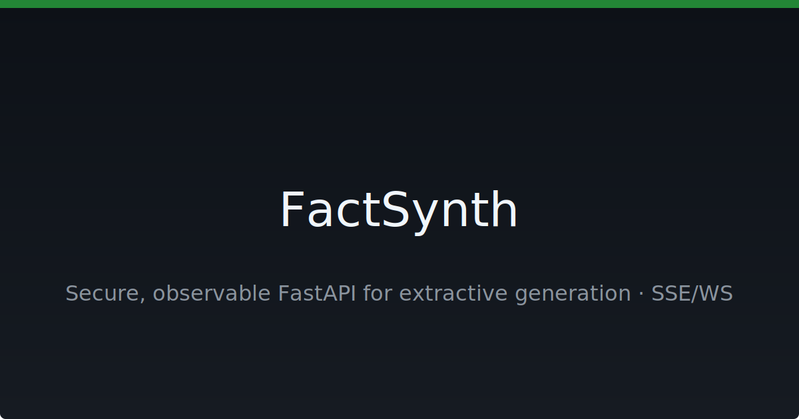

# FactSynth

[](https://github.com/neuron7x/FactSynth/actions/workflows/ci.yml)
[](https://github.com/neuron7x/FactSynth/actions/workflows/codeql.yml)
[](LICENSE)
[](https://github.com/neuron7x/FactSynth/stargazers)



Швидкий мікросервіс **FastAPI** для відображення наміру та екстрактивної генерації з потоковою передачею SSE/WebSocket, помилками у форматі Problem+JSON, лімітами запитів і розширеною спостережуваністю.

Мова: [English](README.md) · Українська

## Зміст

- [Про проєкт](#про-проєкт)
- [Можливості](#можливості)
- [Технології](#технології)
- [Швидкий старт](#швидкий-старт)
- [Встановлення](#встановлення)
- [Використання](#використання)
- [Приклади](#приклади)
- [Конфігурація](#конфігурація)
- [Демо та OpenAPI](#демо-та-openapi)
- [Спостережуваність](#спостережуваність)
- [Безпека](#безпека)
- [Дорожня карта](#дорожня-карта)
- [Внесок](#внесок)
- [Ліцензія](#ліцензія)
- [Подяки](#подяки)

## Про проєкт

FactSynth — це мікросервіс FastAPI для екстрактивної генерації тексту. Він призначений для команд, які потребують безпечних та прозорих API з потоковими відповідями через Server-Sent Events або WebSocket. Клієнти отримують помилки у стандартизованому форматі Problem+JSON, а оператори мають метрики, структуровані логи та гачки трасування.

## Можливості

- Екстрактивна генерація через кінцеві точки FastAPI.
- Потокові відповіді — підтримка SSE та WebSocket.
- Контроль доступу — заголовок API-ключа та списки дозволених IP.
- Лімітування запитів — ковзне вікно на кожного клієнта.
- Помилки у форматі Problem+JSON (RFC 9457).
- Спостережуваність — метрики Prometheus, структуровані логи та OpenTelemetry.

## Технології

[](https://www.python.org/)
[](https://fastapi.tiangolo.com/)
[](https://www.uvicorn.org/)

Python 3.10+ · FastAPI 0.116 · Uvicorn 0.35

## Швидкий старт

```bash
git clone https://github.com/neuron7x/FactSynth.git
cd FactSynth
python -m venv .venv && source .venv/bin/activate
pip install -U pip && pip install -r requirements.lock -r requirements-dev.txt
uvicorn factsynth_ultimate.app:app --reload
```

## Встановлення

Налаштуйте локальне середовище розробки:

```bash
git clone https://github.com/neuron7x/FactSynth.git
cd FactSynth
python -m venv .venv
source .venv/bin/activate
pip install -U pip
pip install -r requirements.lock -r requirements-dev.txt
# або встановіть у режимі редагування:
# pip install -e .[dev]
```

`requests` забезпечує контрактні тести, а `PyYAML` — валідацію схем; інші залежності доступні у `requirements-dev.txt` або через extra `dev`.

## Використання

Запустіть сервіс локально:

```bash
source .venv/bin/activate
export API_KEY=change-me   # опційно
uvicorn factsynth_ultimate.app:app --host 0.0.0.0 --port 8000 --reload
```

Допоміжні утиліти, такі як NLI-класифікатор та оцінювач тверджень, розміщені у пакеті `factsynth_ultimate.services`. Модуль `app` видалено.

Також можна використати Docker:

```bash
docker run --rm -p 8000:8000 ghcr.io/neuron7x/factsynth:latest
```

## Приклади

Запит на генерацію через `curl`:

```bash
curl -s -X POST http://localhost:8000/v1/generate \
  -H "x-api-key: ${API_KEY:-test-key}" \
  -H "content-type: application/json" \
  -d '{"prompt": "Видобути факти про воду."}'
```

Типова відповідь JSON:

```json
{
  "facts": ["Вода замерзає при 0°C", "Вода кипить при 100°C"]
}
```

## Конфігурація

Потрібен екземпляр Redis для лімітування запитів; встановіть `RATE_LIMIT_REDIS_URL` на відповідний URL.

| Змінна | За замовчуванням | Опис |
| ------ | ---------------- | ---- |
| `ENV` | `dev` | Назва середовища |
| `HTTPS_REDIRECT` | `false` | Перенаправлення HTTP на HTTPS |
| `CORS_ALLOW_ORIGINS` | *(порожньо)* | Допустимі origin через кому. За замовчуванням усі блокуються; вкажіть явні домени. |
| `AUTH_HEADER_NAME` | `x-api-key` | Заголовок з API-ключем |
| `IP_ALLOWLIST` | *(порожньо)* | Дозволені IP, розділені комами |
| `RATE_LIMIT_REDIS_URL` | *(немає)* | URL Redis для лімітування |
| `RATE_LIMIT_PER_KEY` | `120` | Запитів на хвилину на API-ключ |
| `RATE_LIMIT_PER_IP` | `120` | Запитів на хвилину на IP |
| `RATE_LIMIT_PER_ORG` | `120` | Запитів на хвилину на організацію |
| `SKIP_AUTH_PATHS` | `/v1/healthz,/metrics` | Шляхи без автентифікації |
| `LOG_LEVEL` | `INFO` | Рівень логування |
| `VAULT_ADDR` | *(порожньо)* | URL сервера Vault |
| `VAULT_TOKEN` | *(порожньо)* | Токен аутентифікації Vault |
| `VAULT_PATH` | *(порожньо)* | Шлях до секрету у Vault |

За замовчуванням крос-доменні запити не дозволені. Адміністратори мають
встановити `CORS_ALLOW_ORIGINS`:

```bash
export CORS_ALLOW_ORIGINS="https://example.com,https://another.example"
```

Використовуйте `CORS_ALLOW_ORIGINS=*` лише у тестових середовищах.

## Демо та OpenAPI

Перегляньте [документацію OpenAPI](https://neuron7x.github.io/FactSynth/).

## Спостережуваність

- Метрики Prometheus доступні на `/metrics`.
- Структуровані логи з ідентифікаторами запитів.
- Гачки трасування готові до OpenTelemetry.

## Безпека

Див. [SECURITY.md](SECURITY.md) для приватного повідомлення про вразливості. CodeQL та Dependabot контролюють залежності та код.

## Дорожня карта

Плановані функції відстежуються у [issues](https://github.com/neuron7x/FactSynth/issues).

## Внесок

Див. [CONTRIBUTING.md](CONTRIBUTING.md). Проєкт дотримується [Code of Conduct](CODE_OF_CONDUCT.md).

## Ліцензія

[MIT](LICENSE)

## Подяки

<!-- ALL-CONTRIBUTORS-LIST:START - Do not remove or modify this section -->

<!-- ALL-CONTRIBUTORS-LIST:END -->

Цей проєкт використовує специфікацію all-contributors.

